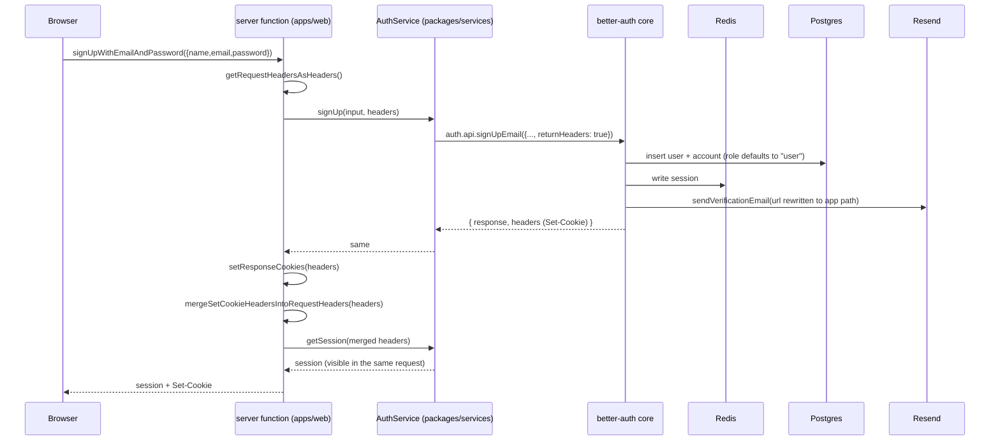

# feat: Add authentication (better-auth) and category subscriptions on a TanStack Start app

## Overview

`brief` has no user model. `AGENT.md` and `docs/daily-pipeline-workflow.md` both state plainly that subscriber, subscription, and delivery models do not exist, and `docs/plans/2026-08-05-001` shipped `message_jobs` as a deliberately empty scaffold waiting for exactly that.

This plan introduces the missing half: real users with email/password authentication (better-auth), a `user`/`admin` role, and a user-to-category subscription model. It also replaces the HTTP layer — `apps/hono` and `apps/react` are removed in favour of a single TanStack Start app, `apps/web`, where endpoints are TanStack **server functions** rather than Hono routes.

Scope is deliberately backend-shaped: **server functions only, no pages, no UI**. All business logic stays in `packages/services`, consistent with how every other domain in this repo is organised.

## Problem Frame

Three problems converge here.

**No identity.** Every table in the schema is pipeline machinery — categories, providers, articles, jobs. Nothing models a person. The pipeline produces briefs that nobody can be assigned to, which is why `ProcessingService.sendMessage` is still a stub and `message-worker` logs "not implemented" and acks.

**No subscription axis.** `categories` exist and are fetched, processed, and voiced, but there is no answer to "who wants this category?". `message_jobs` is one row per `category_job`; fan-out to recipients was explicitly deferred in plan `2026-08-05-001` pending this model.

**Two backends, neither carrying the product.** `apps/hono` exposes exactly one route (`/health`). `apps/react` is monorepo-template boilerplate doing CRUD against `posts`/`users` endpoints that were never implemented. Rather than add auth to a Hono app that is about to be replaced, the HTTP layer is collapsed into one TanStack Start app.

The reference implementation is the sibling repo `../ocr`, which already runs TanStack Start + better-auth + Resend with the same services-package layering. Its patterns are reused rather than reinvented; where they are not, this plan says why.

## Requirements Trace

- **R1.** Users can sign up and sign in with email and password.
- **R2.** The eight auth operations are callable as endpoints: `signInWithEmailAndPassword`, `signUpWithEmailAndPassword`, `signOut`, `getSession`, `requestPasswordReset`, `resetPassword`, `verifyEmail`, `sendVerificationEmail`.
- **R3.** Email verification and password reset send real emails through Resend, with links pointing at a stable, agreed URL contract.
- **R4.** Every user carries a role constrained to `user` or `admin`, defaulting to `user`.
- **R5.** A user can subscribe to and unsubscribe from categories, and list their own subscriptions.
- **R6.** All business logic lives in `packages/services`; `apps/web` holds transport and wiring only.
- **R7.** Endpoints are TanStack server functions. No Hono, no separate API process.
- **R8.** Removing `apps/hono` and `apps/react` does not break the four workers or the scheduler.

## Scope Boundaries

- **No pages, no UI whatsoever** — including `/validate-email` and `/reset-password`. Only server functions and the minimum app scaffold needed to host them. The email URL contract is frozen now; the links 404 until the UI lands, and that is accepted (see Key Technical Decisions).
- **No admin script.** Promoting a user to `admin` is a separate task, explicitly out of scope.
- **No admin endpoints or admin UI.** The role exists and is enforceable; nothing consumes it yet.
- **No tests.** Confirmed with the user. `packages/services` has vitest configured and this plan adds no test files.
- **No cleanup of the Hono-coupled infra code.** `packages/infra/src/{factories,middlewares,schemas,helpers,types}` and the `hono`/`hono-openapi`/`@hono/*` dependencies stay in place, orphaned, along with `.claude/skills/create-hono-endpoint`. Separate ticket.
- **No wiring of subscriptions into the delivery pipeline.** `message_jobs` fan-out to subscribers is the natural next step and is named as such by `docs/plans/2026-08-05-001`, but it is not this plan.
- **No OAuth / social providers, no 2FA, no magic links, no organisations.**
- **No rate limiting configuration** beyond better-auth's defaults.

## Context & Research

### Relevant Code and Patterns

**In `brief` (conventions to follow):**

- `packages/services/src/modules/*/` — one directory per domain, a `<domain>.service.ts` exporting a class with dependencies injected through the constructor, an optional sibling `<domain>.type.ts`, and an export line added to `packages/services/src/index.ts`. `categories.service.ts` is the minimal example; `s3.service.ts` is the example of a service taking an injected **config object** alongside `db` — the pattern this plan reuses for auth and mail secrets.
- `packages/services/src/modules/health/health.service.ts` — the error/logging idiom: `getLoggerStore()` from `@brief/infra/libs` (AsyncLocalStorage, not a constructor param), and `InternalError` from `@brief/infra/errors` carrying a code from `INTERNAL_ERROR_CODE` in `@brief/common/constants`. Services never `throw new Error`.
- `db/drizzle/src/db/schema.ts` — one file, all tables, `defineRelations` at the bottom wiring every relation in a single call. Domain entities use `uuid` PKs with `default sql\`uuidv7()\``; job tables use `serial`. Timestamps are `timestamp(..., { withTimezone: true })`. Enums are `pgEnum` backed by constants from `@brief/common/constants` (`language`, `connectorKind`, `fileKind`, `jobStatus`).
- `db/drizzle/src/db/schema.ts` — `categoryProviders` is the house join-table shape: composite primary key over the two FKs, `onDelete: "cascade"` on both, and an index on the second FK. `subscriptions` copies this shape exactly.
- `apps/category-worker/src/config/env.ts` — the per-app env convention: each app parses its **own** narrow zod schema from `process.env` rather than extending a global one.
- `apps/hono/src/services/container.ts` — the existing hand-wired container (`createServices()` building `db` + services). `apps/web` needs the same idea; `../ocr`'s `globalThis`-pinned singleton is the adaptation for a dev-server environment that re-imports modules.
- `docs/plans/2026-08-05-001-feat-message-job-base-plan.md` — the house plan format, and the record that the twelve historical migrations were squashed into one fresh initial migration (`db/drizzle/drizzle/20260805112351_jazzy_gressill/`) on 2026-08-05. New migrations are therefore incremental again.

**In `../ocr` (implementation reference):**

- `packages/services/src/auth/{auth.ts,auth.service.ts,auth.types.ts}` — `createAuth()` building the `betterAuth()` config (drizzle adapter + redis secondary storage + email/password + verification hooks), and `AuthService` wrapping `auth.api.*` with exactly the eight methods this plan needs.
- `packages/services/src/mail/{mail.service.ts,mail.types.ts,templates/}` — Resend wrapper, shared HTML shell template, verification and reset templates, and the non-production recipient override.
- `apps/web/src/libs/server/headers.ts` — **the piece that is easy to miss and non-negotiable in a headless setup**: `getRequestHeadersAsHeaders()`, `setResponseCookies()`, `mergeSetCookieHeadersIntoRequestHeaders()`. Without it, better-auth issues a session cookie that never reaches the browser.
- `apps/web/src/libs/server/{errors.ts,error-handling.ts,session.ts,container.ts}` — `ServerError` / `withServerErrorLogging` / `isAPIError` / `requireUser`.
- `apps/web/src/libs/api/auth.tsx` — the `createServerFn` + zod `inputValidator` + `withServerErrorLogging` shape for each endpoint.
- `apps/web/src/{router.tsx,server.ts}` and `apps/web/src/routes/__root.tsx` — router context typing and the once-per-navigation session load. Relevant later for the UI plan; only `server.ts`/`router.tsx` matter here.
- `CLAUDE.md` gotcha, carried forward: `BETTER_AUTH_URL` must match the origin the browser actually uses, and non-localhost hostnames (proxies, health probes) need an allowed-hosts list.

### Institutional Learnings

`docs/solutions/` does not exist in this repo, and there are no ADRs. The available institutional knowledge is:

- `AGENT.md` — "Subscriber, subscription, and delivery models do not exist." This plan is the first half of closing that gap, and `AGENT.md` must be updated by it.
- `docs/daily-pipeline-workflow.md` Step 6 — delivery is the open end of the pipeline; subscriptions are its missing input.
- `docs/plans/2026-08-05-001` Key Technical Decisions — retry/per-recipient tracking for message delivery was deferred *specifically* because the subscriber model did not exist. That deferral becomes actionable after this plan, not during it.

### External References

Context7 is unavailable in this environment (`CONTEXT7_API_KEY` is not set) and the broader documentation research pass was declined, so no prose documentation was consulted. One targeted verification was run directly against the npm registry, and it settled the plan's largest unknown:

| Fact | Value |
|---|---|
| `better-auth` current version | `1.6.26` |
| `@better-auth/drizzle-adapter@1.6.26` peer requirement | `drizzle-orm: ^0.45.2` |
| This repo's version | `drizzle-orm@1.0.0-rc.4` |
| `drizzle-orm` dist-tags | `latest = 0.45.2`, `rc = 1.0.0-rc.4`, `beta = 1.0.0-beta.22` |
| `@better-auth/kysely-adapter` | shipped as a **direct dependency** of `better-auth`, not an optional install |
| `@tanstack/react-start` | declared peer of `better-auth` at `^1.0.0` |

**`^0.45.2` does not satisfy `1.0.0-rc.4`.** The Drizzle adapter's supported range explicitly excludes this repo's version, and Drizzle v1.0 is still a release candidate — `latest` remains `0.45.2`. This is not a grey area to be discovered later; it is a stated incompatibility, and it reshapes Unit 1 from "investigate whether this works" into "confirm whether it works anyway, and fall back if not".

Note on the better-auth "Joins (Experimental)" documentation, which appears to say Drizzle relations are supported: the `1.4.0` version named there is **better-auth's** version, not `drizzle-orm`'s, and the relation API it describes (per-table `relations()` exports passed into the adapter's schema object) is the 0.4x-era API. This repo uses `defineRelations()` — a single global relations object handed to the client — which has no direct equivalent in that instruction. Joins are also opt-in via `experimental.joins`, so they are not the deciding factor either way; the base read/write path of the adapter is.

Everything else version-specific below — `@better-auth/redis-storage`, `resend`, `ioredis`, and the TanStack Start API surface — is carried over from `../ocr` and is **not** independently verified. Those are confirmed at install time.

## Key Technical Decisions

- **The Drizzle adapter is not usable as-is, and the fallback is first-party.** Verified against the npm registry: `@better-auth/drizzle-adapter@1.6.26` requires `drizzle-orm@^0.45.2`, this repo runs `1.0.0-rc.4`, and the ranges do not intersect. The fallback is to hand better-auth a `pg` pool so it drives its own tables through the Kysely adapter it already bundles — `@better-auth/kysely-adapter` is a direct dependency of `better-auth`, so nothing extra is installed.

  **This is not a change of ORM, and must not be read as one.** Kysely is an implementation detail internal to better-auth: no Kysely is imported, written, or exposed anywhere in this repo. Drizzle remains the ORM for the entire codebase — every service, every worker, every query. The fallback changes exactly one thing: which SQL layer writes to better-auth's own three tables (`user`, `account`, `verification`). Those tables are still declared in `db/drizzle/src/db/schema.ts`, still migrated by drizzle-kit, and still queryable through Drizzle — the `subscriptions ↔ user` relation works identically under either route. **drizzle-kit stays the single migration authority** because better-auth's runtime does not care how its tables came to exist.

  Two costs are given up or added. First, the adapter's guarantee that the schema matches what better-auth expects becomes a hand-maintained correspondence, so drift surfaces as a runtime write failure — which is why Unit 4 gains a diff step. Second, passing a separate pool means two connection pools against the same Postgres. The clean fix is to build one `pg` pool and give it to both: `db/drizzle/src/index.ts` currently calls `drizzle(connectionString)`, and Drizzle also accepts an existing pool, so `createDb` would take one. Small change, worth doing rather than running two pools by accident.

- **better-auth runs headless — no `/api/auth/*` catch-all, no `createAuthClient`.** Rationale: it keeps all business logic inside `packages/services` (R6) and, because the `admin` plugin is enabled, it means the plugin's privileged endpoints (list users, set role, ban, impersonate) are reachable at no URL at all. A mounted handler would expose them, protected only by better-auth's own role check. The cost is that every operation must be hand-wrapped — eight today. Accepted.

- **Consequence of headless: the default verification link is dead, so email URLs are rewritten.** better-auth's default verification URL points at `/api/auth/verify-email`, a route this app will not have. Following `../ocr`, `sendVerificationEmail` and `sendResetPassword` rewrite the URL to an app-owned path carrying the token. This is not a stylistic choice; without it the emails are broken.

- **Sessions live in Redis via `secondaryStorage`; there is no `session` table in Postgres.** Chosen by the user over a Postgres session table. Consequences to accept knowingly: Redis becomes a hard runtime dependency of `apps/web` (a Redis outage is a full logout, not a slow login); session state is not inspectable with `psql`; and the `admin` plugin's session operations depend on better-auth's per-user active-session bookkeeping in secondary storage rather than on rows.

- **`session.cookieCache` enabled (~5 minutes).** Avoids a Redis round-trip per navigation. **Security caveat that must be documented in code:** a cached session cookie is trusted without consulting storage, so revoking a session, banning a user, or changing a role does **not** take effect until the cache window expires. With no admin surface today the blast radius is nil; it becomes material the moment ban or role-change ships. If that tradeoff is unwanted, the correct lever is lowering `maxAge`, not removing Redis.

- **`admin` plugin rather than a hand-rolled `role` column.** Chosen by the user. Note it is not a single column: the plugin extends the `user` model with `role`, `banned`, `banReason`, and `banExpires` (and `impersonatedBy` on the session model — which here lives in Redis, so no column). The schema must carry all of them even though only `role` is used.

- **`role` constrained by a `pgEnum("user_role", ["user", "admin"])` with default `"user"`.** The plugin treats `role` as a free-form string; the enum is a database-level guarantee that nothing else ever gets written. Constants go in `packages/common/src/constants/`, matching `LANGUAGE`, `CONNECTOR_KIND`, `FILE_KIND`. **Risk to verify in Unit 1:** if the plugin ever writes a value outside the enum (a multi-role comma-separated string, or a role from an access-control config), the insert fails at the database. Restricting the plugin config to exactly these two roles is part of the unit.

- **better-auth tables use `text` primary keys with better-auth generating the IDs.** Chosen by the user, matching `../ocr`. This diverges from brief's `uuid`/`uuidv7()` convention for domain entities, and the visible consequence is that `subscriptions.user_id` is `text` while `subscriptions.category_id` is `uuid`. Accepted: `user`, `account`, and `verification` are better-auth's tables, and fighting the adapter over ID generation buys nothing.

- **better-auth tables keep better-auth's default singular names** (`user`, `account`, `verification`), against brief's otherwise-uniform plural convention (`categories`, `providers`, `articles`, `files`). Rationale: it is the adapter's zero-configuration path, it matches `../ocr` exactly, and it reinforces the same boundary as the ID decision — these three tables belong to better-auth, everything else belongs to brief. The alternative (plural names plus an adapter-level plural mapping) adds a configuration surface that also has to be correct for every future plugin-added model. **This specific point was inferred, not confirmed with the user** — see Open Questions.

- **`subscriptions` is a pure join table with a composite primary key.** Structurally identical to `category_providers` (composite PK, cascade both sides, index on the second FK), but named in the domain vocabulary `AGENT.md` and `docs/daily-pipeline-workflow.md` already use. `created_at` is kept — unlike `category_providers`, a subscription is a user-generated event and when it happened will matter for delivery and analytics. Rejected: a separate `uuid` surrogate key, since nothing needs to reference a subscription by ID.

- **Subscription endpoints are granular and idempotent** (`subscribe`, `unsubscribe`, `getMySubscriptions`) rather than a replace-all `setMySubscriptions`. Granular operations cannot silently clobber a change made in another tab between load and save.

- **Auth secrets are parsed by an app-local env schema and injected through constructors**, not added to `packages/infra/src/configs/env.ts`. This is a correctness requirement, not a style preference: that file runs `envSchema.parse(process.env)` **at import time** and is imported by every worker, so adding a required `BETTER_AUTH_SECRET` there would crash `category-worker`, `providerFetch-worker`, `message-worker`, and `scheduler` on boot in every environment where the variable is absent (R8). Injection also matches the existing `S3Service(db, config)` precedent.

- **Mail links are built from `BETTER_AUTH_URL`, not `FRONTEND_URL`.** `apps/web` serves both the endpoints and (eventually) the pages, so its public origin is a single value; two variables that must be kept equal is a footgun. `FRONTEND_URL` predates this work and is left untouched. **Inferred, not confirmed with the user** — see Open Questions.

- **`requireEmailVerification: true`.** Secure by default and forces the whole verification flow to be correct immediately. **Correction, verified during implementation:** the token is a signed JWT carried in the link, and no row is written to the `verification` table — that table stayed empty across sign-ups. So the developer workflow is to take the URL from the Resend-delivered email (or intercept the mailer call), *not* to read a token out of the database. The observed link matches the frozen contract exactly: `{BETTER_AUTH_URL}/validate-email?token=<jwt>&callbackURL=%2F`.

- **Non-production email recipients are redirected to Resend's sink address**, following `../ocr`, so that development and staging cannot email real people.

- **`apps/web` is scaffolded with the TanStack CLI and then rewired**, rather than hand-copying `../ocr/apps/web`. The CLI gives a current, officially-shaped socle; `../ocr`'s patterns are then applied on top for the parts that matter (container, headers, errors, server functions). Copying wholesale would import `../ocr`'s pinned versions and choices into a repo running much newer tooling (TypeScript 6, Vite 8, Drizzle 1.0-rc).

- **`apps/hono` and `apps/react` are deleted in this plan; the Hono-coupled infra code is not.** Deleting the two apps is safe and mechanical — `apps/hono` exposes only `/health` and `apps/react` is unwired template boilerplate. Unpicking `hono` from `packages/infra` requires checking every worker's imports and is a larger, riskier diff for zero functional gain here.

## Open Questions

### Resolved During Planning

- Whether to migrate `apps/react` in place or create a new app: resolved with the user — new `apps/web`, both old apps deleted.
- Sessions in Postgres or Redis: resolved with the user — Redis `secondaryStorage`, implementing the `@brief/infra/redis` subpath that `packages/infra/package.json` already reserves but does not back with any source.
- Custom `role` column or the `admin` plugin: resolved with the user — the `admin` plugin.
- Headless better-auth or a mounted catch-all: resolved with the user — headless only.
- UI scope: resolved with the user — server functions only, no pages, not even for the two email landing paths.
- Primary key type for better-auth tables: resolved with the user — `text`, generated by better-auth.
- Subscription table shape and name: resolved with the user — `subscriptions`, composite PK.
- Subscription endpoint shape: resolved with the user — granular `subscribe`/`unsubscribe`/`getMySubscriptions`.
- Where email links point: resolved with the user — freeze the URL contract now, accept that links 404 until the UI ships.
- `requireEmailVerification`: resolved with the user — `true`.
- How `apps/web` is created: resolved with the user — TanStack CLI, then adapted.
- Fate of the Hono-coupled infra code: resolved with the user — left orphaned, separate ticket.
- Error-handling layer: resolved with the user — port `../ocr`'s `ServerError` / `withServerErrorLogging` / `isAPIError`; services keep raising `InternalError`.
- Where auth env vars live: resolved with the user — app-local schema plus constructor injection, explicitly *not* `packages/infra/src/configs/env.ts`.
- Tests: resolved with the user — none in this plan.
- Whether `subscribe` accepts a disabled category: resolved during planning — no. Subscribing to a category the pipeline will never run for is a silent dead end; it fails with a dedicated internal error code.
- Whether category listing is public: resolved during planning — behind `requireUser()`. There is no anonymous surface in this product yet, and opening one is a product decision nobody has made.
- Migration strategy: resolved during planning — one new incremental migration. The squash performed on 2026-08-05 reset the history; there is no second squash to do here.

### Deferred to Implementation

- **Whether the Drizzle adapter works *in practice* on `drizzle-orm@1.0.0-rc.4` despite the declared incompatibility.** The support question itself is now answered (see External References — the peer range excludes this version), so what remains is narrower and empirical: does the adapter's read/write path actually function against the RC, or does it break on Drizzle v2 internals? Unit 1 answers this by trying it. A negative result is not a blocker — it selects the bundled Kysely path instead.
- **The exact current TanStack Start API surface** — the scaffold command, the generated project layout, and the precise `createServerFn` / request-and-response-header helper names at the version the CLI installs. `../ocr` is on `@tanstack/react-start@1.168.x`; this repo will land on whatever is current, and these APIs have moved between versions. Resolved by reading the scaffold output, not by guessing now.
- **The exact better-auth version to pin** and whether the `admin` plugin's field set still matches what is described above. Confirmed while installing.
- **Whether the `admin` plugin can write a `role` value the `user_role` enum rejects** (multi-role strings, access-control-derived roles). Verified against the installed version in Unit 1; if it can, the enum is replaced by a text column with a check constraint.
- **Redis key prefix and connection lifecycle in dev** — whether the TanStack Start dev server's module reloading needs the Redis client pinned on `globalThis` alongside the container to avoid connection leaks. Observed at runtime, not predicted.
- **How subscriptions eventually feed `message_jobs` fan-out** — deliberately out of scope; named here because `docs/plans/2026-08-05-001` blocked its retry design on exactly this model existing.

## High-Level Technical Design

> *Directional guidance for review, not implementation specification.*

The request path, and specifically the cookie problem the headless setup creates:



The two header helpers are what make this work. Without `setResponseCookies`, better-auth mints a session the browser never receives. Without the merge step, the `getSession` call in the *same* request still sees the pre-sign-in cookie jar and returns null.

Layering, and the boundary the plan defends:

```
apps/web  ── transport only ──────────────────────────────
  config/env.ts        parses BETTER_AUTH_*, RESEND_*, REDIS_URL
  libs/server/         container, headers, errors, requireUser
  libs/api/            server functions (thin: validate → call → shape)
        │  constructor injection of { db, redis, config }
        ▼
packages/services ── all business logic ──────────────────
  modules/auth/         AuthService  → better-auth core
  modules/mail/         MailService  → Resend
  modules/subscriptions/SubscriptionsService → db
        │
        ▼
db/drizzle + packages/infra/redis
```

## Implementation Units

### Phase A — Foundations

- [ ] **Unit 1: Spike — validate better-auth against this repo's Drizzle version**

**Goal:** Pick the database strategy for better-auth, given a now-verified peer-dependency incompatibility, before any dependent code is written.

**Requirements:** Precondition for R1–R5

**Dependencies:** None. **Blocks Units 3, 5, 6, 7.**

**Files:**
- Modify: `packages/services/package.json` (add `better-auth`, `@better-auth/redis-storage`, `resend`)
- Scratch only — no production code is committed from the spike itself beyond the dependency additions and the decision recorded in this plan.

**Approach:**
- Start from the verified fact rather than re-deriving it: `@better-auth/drizzle-adapter@1.6.26` requires `drizzle-orm@^0.45.2`, this repo is on `1.0.0-rc.4`, and the ranges do not intersect. The decision is between accepting an unsupported combination and taking the bundled Kysely path.
- **Route A — try the Drizzle adapter anyway.** Timebox it. Install with the peer warning and exercise the operations better-auth actually performs: create a user, read by email, update, and delete, plus whatever the `admin` plugin's fields require. Two specific breakage points to probe: whether the adapter touches Drizzle internals that moved in the v2 line, and whether it tolerates a client built with `{ relations }` rather than `{ schema }` as `db/drizzle/src/index.ts` does. Leave `experimental.joins` off — it is opt-in, it is where the relations API differences bite hardest, and the base path is what matters. If this works, the plan proceeds unchanged, with the peer mismatch recorded and pinned.
- **Route B — hand better-auth a `pg` pool** and let it drive its tables through the Kysely adapter it already ships. No extra dependency, no peer conflict. Keep drizzle-kit as the single migration authority: the tables stay declared in the schema file and stay migrated by drizzle-kit, since better-auth's runtime does not care how they were created. The cost is that schema correspondence becomes hand-maintained rather than adapter-guaranteed — so this route adds one obligation to Unit 4: generate better-auth's own expected schema once and diff it against the hand-authored definitions, so drift is caught at migration time rather than as a runtime write failure.
- Record the chosen route in this document, with the versions pinned, before starting Unit 3.
- Independently of the route, settle three things while the dependency is installed: the `admin` plugin's exact field set on the `user` model; whether that plugin can ever write a `role` value outside `user`/`admin` under a two-role configuration (this decides `pgEnum` versus text-plus-check in Unit 3); and that `@better-auth/redis-storage` accepts an `ioredis` client, with its current option shape.

**Outcome (recorded 2026-08-07): Route A. The Drizzle adapter works.** Exercised against a real Postgres with the real configuration — `better-auth@1.6.26` + `@better-auth/redis-storage` secondary storage + the `admin` plugin, on `drizzle-orm@1.0.0-rc.4`. Sign-up created the user with `role: "user"` and the plugin's `banned`/`banReason`/`banExpires` fields populated, a `Set-Cookie` header was issued, sign-in succeeded, and `getSession` returned the role. Three things were settled along the way:

- **The adapter demands a `session` model unless `secondaryStorage` is configured.** A first attempt without it failed with "the model `session` was not found in the schema object". With Redis secondary storage configured, no `session` table is needed — which is the configuration this plan ships.
- **The `admin` plugin writes `"user"` verbatim**, so the `user_role` enum is safe; no text-plus-check fallback is needed.
- **`@better-auth/redis-storage` requires `ioredis@^5`, not `^6`.** Installing the latest `ioredis` produces an unmet peer; both `@brief/infra` and `@brief/services` are pinned to `^5`.

Redis keys observed confirm the per-user session bookkeeping this plan assumed: individual session keys plus an `active-sessions-<userId>` key under the configured prefix.

**Versions are pinned to the patch range (`~1.6.26`) rather than the minor.** This combination is not covered by better-auth's declared peer range, so a minor bump could break it silently on the authentication path; patch releases still flow for security fixes. Revisit when either better-auth supports Drizzle v2 or this repo moves off the RC channel.

**Original recommendation, kept for context:** try Route A first, but timebox it hard. It is the smaller structural change, and if it works the repo keeps one database abstraction. Route B is the safer destination and is available at any point — an unsupported peer combination on the authentication path is a liability that a future `pnpm update` can trigger, so a Route A result of "works today" should be pinned and commented, not treated as settled.

**Patterns to follow:**
- `packages/services/package.json` for dependency placement — better-auth belongs to the services package, not to `apps/web`, mirroring `../ocr` where `apps/web` reaches better-auth only transitively.

**Test scenarios:**
- Test expectation: none — this is a throwaway investigation whose only durable output is a decision recorded in this document. No behaviour ships.

**Verification:**
- This plan's "Deferred to Implementation" entry for adapter compatibility is replaced by a recorded decision naming the chosen strategy and the pinned versions.
- A minimal end-to-end probe succeeds: create a user row and read it back through the chosen adapter path against a local Postgres.

---

- [ ] **Unit 2: Add the Redis client and its infrastructure**

**Goal:** Back the `@brief/infra/redis` export that `packages/infra/package.json` already declares but which has no source behind it, and make Redis available locally.

**Requirements:** Precondition for R1, R2

**Dependencies:** None (parallel with Unit 1)

**Files:**
- Create: `packages/infra/src/redis/index.ts`
- Modify: `packages/infra/package.json` (add `ioredis`)
- Modify: `docker-compose.yaml`
- Modify: `.env.example`

**Approach:**
- Expose a factory taking a connection URL and returning a client, plus a shared instance, mirroring how `db/drizzle/src/index.ts` offers both `createDb(connectionString)` and a default `db`. The URL is passed in by the caller rather than read from a module-level env parse — that is the whole point of the config decision above, and baking `process.env` access into `packages/infra` would reintroduce the boot-crash risk from a different direction.
- Add a `redis` service to `docker-compose.yaml` in the file's existing style: an explicit `container_name` following the `brief-<service>-dev` pattern, the port published on `127.0.0.1` only, a healthcheck, and a named volume registered in the top-level `volumes` block.
- Add `REDIS_URL` and the better-auth key prefix to `.env.example` under a new commented section header, matching the file's existing grouping style.

**Patterns to follow:**
- `docker-compose.yaml` — the `postgres` service is the closest template (container name, loopback-bound port, healthcheck, named volume).
- `db/drizzle/src/index.ts` — the factory-plus-default-instance export shape.
- `packages/infra/src/amqp/` — how an infra subpath module is organised and re-exported.

**Test scenarios:**
- Test expectation: none — no existing `packages/infra` module has tests, and this is a thin client wrapper with no logic of its own.

**Verification:**
- `docker compose up redis` starts and reports healthy.
- Importing from `@brief/infra/redis` resolves and type-checks after building the package — confirming the previously-dangling export subpath is now real.
- No worker's behaviour changes: nothing imports the new module yet.

### Phase B — Data model

- [ ] **Unit 3: Add the auth and subscription tables to the schema**

**Goal:** Model users, better-auth's supporting tables, the role enum, and the user-to-category subscription.

**Requirements:** R1, R4, R5

**Dependencies:** Unit 1 (its outcome determines whether these definitions drive the migration or mirror what better-auth creates)

**Files:**
- Modify: `db/drizzle/src/db/schema.ts`
- Create: `packages/common/src/constants/userRole.constant.ts`
- Modify: `packages/common/src/constants/index.ts`
- Create: `packages/common/src/types/userRole.type.ts`
- Modify: `packages/common/src/types/index.ts`

**Approach:**
- Add a `USER_ROLE` constant and its derived type alongside the existing `LANGUAGE`/`CONNECTOR_KIND`/`FILE_KIND` constants, then a `pgEnum("user_role", ...)` built from it — unless Unit 1 found the plugin can emit other values, in which case a text column with a check constraint replaces the enum.
- Add `user`, `account`, and `verification` with `text` primary keys, following `../ocr`'s definitions but with this repo's timestamp convention (`withTimezone: true`, no explicit precision). The `user` table carries better-auth's base fields plus every field the `admin` plugin expects — `role` (defaulting to `user`), `banned`, `banReason`, `banExpires` — even though only `role` is exercised. A missing plugin field surfaces as a runtime write failure, not a type error.
- No `session` table: sessions live in Redis. Add a comment saying so at the point where a reader would expect the table, so its absence reads as a decision rather than an oversight.
- Add `subscriptions` with a composite primary key over (`user_id`, `category_id`), both FKs cascading on delete, an index on `category_id`, and `created_at`.
- Register every new table in the `defineRelations` map and wire the relations: `user` has many `subscriptions`, `categories` has many `subscriptions`, `subscriptions` belongs to one of each, and `account` belongs to one `user`.

**Patterns to follow:**
- `categoryProviders` in `db/drizzle/src/db/schema.ts` — the composite-PK join-table shape, cascades, and second-FK index, copied structurally.
- `packages/common/src/constants/language.constant.ts` and its `pgEnum` consumer — the constant-to-enum idiom.
- `../ocr/db/src/schemas/{user,account,verification}.ts` — the better-auth column set.

**Test scenarios:**
- Test expectation: none — pure schema definition with no runtime behaviour, consistent with Unit 1 of `docs/plans/2026-08-05-001`. Correctness is established by the generated migration in Unit 4 and by the services in Phase C compiling against the new tables.

**Verification:**
- The new tables are exported from the schema and the relational queries needed by Unit 7 type-check.
- The `user_role` enum admits exactly `user` and `admin`, with `user` as the column default.

---

- [ ] **Unit 4: Generate and apply the migration**

**Goal:** Bring the database in line with the schema.

**Requirements:** R1, R4, R5

**Dependencies:** Unit 3

**Files:**
- Create: `db/drizzle/drizzle/<generated-timestamp>_<generated-name>/migration.sql`
- Create: `db/drizzle/drizzle/<generated-timestamp>_<generated-name>/snapshot.json`

**Approach:**
- Generate with the repo's existing root script, which loads `.env` before invoking drizzle-kit. The migration is incremental and additive on top of the squashed initial migration from 2026-08-05 — there is no second squash to perform.
- Review the generated SQL before applying: the `user_role` enum creation, the composite primary key and cascade rules on `subscriptions`, the mixed `text`/`uuid` foreign key types, and the index on `category_id`.
- Apply it to the local database and confirm the resulting objects.
- Note that `docs/plans/2026-08-05-001` recorded the local dev database being rebuilt from migrations after a `push`/`migrate` divergence; if the same divergence resurfaces, reconcile before applying rather than forcing.
- **If Unit 1 selected Route B** (better-auth driving its own tables through Kysely), add one step: have better-auth emit its own expected schema and diff it against the hand-authored definitions before applying. Without the adapter enforcing correspondence, a missing or mistyped column surfaces as a runtime write failure on a user-facing path rather than as a migration error.

**Patterns to follow:**
- `db/drizzle/drizzle/20260805112351_jazzy_gressill/` — the shape of a generated migration pair in this repo.

**Test scenarios:**
- Test expectation: none — migration correctness is verified by applying it and inspecting the result, consistent with how every prior migration in this repo has been verified.

**Verification:**
- The four new tables exist with the expected columns, constraints, cascades, and index.
- Re-running generation produces no further diff — schema and migration are in sync.
- Existing pipeline tables are untouched; the workers still run.

### Phase C — Services

- [ ] **Unit 5: Add `MailService`**

**Goal:** A Resend-backed mail service with the verification and reset templates, safe to run outside production.

**Requirements:** R3, R6

**Dependencies:** Unit 1 (dependency installation)

**Files:**
- Create: `packages/services/src/modules/mail/mail.service.ts`
- Create: `packages/services/src/modules/mail/mail.type.ts`
- Create: `packages/services/src/modules/mail/templates/emailShell.template.ts`
- Create: `packages/services/src/modules/mail/templates/verificationEmail.template.ts`
- Create: `packages/services/src/modules/mail/templates/resetPasswordEmail.template.ts`
- Modify: `packages/services/src/index.ts`

**Approach:**
- Constructor takes an injected config object carrying the Resend API key, the sender address, and the current environment — following `S3Service`, and never reading `process.env` inside the service.
- A single private send path that every template goes through, applying the non-production recipient override in one place so no future caller can bypass it.
- Templates return a subject and an HTML body built from a shared shell, in French, branded for Brief. Copy is adapted from `../ocr`, not copied verbatim.
- Failures raise `InternalError` with a dedicated code from `INTERNAL_ERROR_CODE`, and log through `getLoggerStore()`.

**Patterns to follow:**
- `packages/services/src/modules/s3/s3.service.ts` — constructor-injected config plus the `InternalError` and logger idiom.
- `../ocr/packages/services/src/mail/` — the template split and the recipient override.

**Test scenarios:**
- Test expectation: none — no tests in this plan by decision. Noted as a gap: the non-production recipient override is exactly the kind of guard that deserves a test, and is the first thing to cover when tests are added.

**Verification:**
- Calling each template's send path outside production delivers to the sink address, never to the supplied recipient.
- The rendered emails contain the URL passed in, unmodified.

---

- [ ] **Unit 6: Add `AuthService` and the better-auth configuration**

**Goal:** The eight auth operations, exposed as a service, with better-auth fully configured.

**Requirements:** R1, R2, R3, R4, R6

**Dependencies:** Units 1, 2, 3, 5

**Files:**
- Create: `packages/services/src/modules/auth/auth.ts`
- Create: `packages/services/src/modules/auth/auth.service.ts`
- Create: `packages/services/src/modules/auth/auth.type.ts`
- Modify: `packages/services/src/index.ts`

**Approach:**
- `auth.ts` exports a factory building the better-auth instance from injected dependencies — database client, Redis client, mail service, and a config object holding the secret, the app's public URL, and the Redis key prefix. Nothing is read from `process.env`.
- Configure: email and password enabled with verification required; verification sent on sign-up; the `admin` plugin with `user` as the default role and `admin` as the only elevated role; Redis as secondary storage; and the cookie cache with its expiry.
- The verification and reset hooks rewrite better-auth's URL onto app-owned paths carrying the token, then delegate to `MailService`. Rewriting must degrade safely: if the incoming URL cannot be parsed, fall back to sending it unmodified rather than sending a broken link.
- Add a comment at the cookie-cache configuration recording that revocation, ban, and role changes do not take effect until the cache expires. This is the caveat most likely to be forgotten by whoever ships the admin surface.
- `auth.service.ts` exposes exactly the eight methods. Sign-in and sign-up request the response headers back so the caller can propagate the session cookie; the other methods forward the incoming request headers. The service does not touch TanStack APIs — header plumbing is the app's job, keeping the service usable from a script or a worker.
- `auth.type.ts` holds the input and output shapes for the eight methods.

**Patterns to follow:**
- `../ocr/packages/services/src/auth/{auth.ts,auth.service.ts,auth.types.ts}` — near-direct reference, adjusted for injected config and this repo's module layout.
- `packages/services/src/modules/ingestion/ingestion.service.ts` — a service taking other services as constructor dependencies.

**Test scenarios:**
- Test expectation: none — by decision, and additionally because these methods are thin delegations to better-auth; testing them through mocks would assert the mock, not the behaviour. The URL-rewriting helper and its malformed-input fallback are the one genuinely testable piece, and are the second thing to cover when tests are added.

**Verification:**
- Signing up creates a `user` row with `role` set to `user` and sends a verification email.
- Signing in before verification is refused; after verifying, it succeeds.
- A successful sign-in writes a session to Redis under the configured prefix, and no `session` table is consulted.

---

- [ ] **Unit 7: Add `SubscriptionsService`**

**Goal:** Idempotent subscribe, unsubscribe, and list, with category validation.

**Requirements:** R5, R6

**Dependencies:** Units 3, 4

**Files:**
- Create: `packages/services/src/modules/subscriptions/subscriptions.service.ts`
- Create: `packages/services/src/modules/subscriptions/subscriptions.type.ts`
- Modify: `packages/services/src/index.ts`
- Modify: `packages/common/src/constants/internalErrorCode.constant.ts`

**Approach:**
- Constructor takes the database client, matching `CategoriesService`.
- `getMySubscriptions` returns the caller's subscriptions with their categories loaded, using the relational query API the rest of the repo uses.
- `subscribe` first resolves the category and rejects it when missing or disabled, raising `InternalError` with a dedicated non-retryable code; the insert then ignores conflicts so a repeated call is a no-op rather than an error.
- `unsubscribe` deletes by the composite key and tolerates the row not existing.
- Every method takes the user id as an explicit argument. The service never reaches for ambient session state — authorisation is the caller's responsibility and the service stays callable from a script.
- Add the new error code alongside the existing ones.

**Patterns to follow:**
- `packages/services/src/modules/categories/categories.service.ts` — the minimal service shape and the relational query style.
- `packages/services/src/modules/articles/articles.service.ts` — conflict-ignoring inserts.
- `apps/category-worker/src/consumer.ts` — how a non-retryable error code is defined and consumed elsewhere in the repo.

**Test scenarios:**
- Test expectation: none — by decision. Flagged as the highest-value gap in this plan: this is the only unit with real branching logic (idempotency, missing category, disabled category), and it is the natural first test file when tests return.

**Verification:**
- Subscribing twice to the same category leaves exactly one row and does not error.
- Subscribing to an unknown or disabled category fails with the dedicated code and writes nothing.
- Unsubscribing from a category the user is not subscribed to succeeds silently.
- Deleting a user or a category removes the corresponding subscriptions.

### Phase D — The web app

- [ ] **Unit 8: Scaffold `apps/web` and wire the container**

**Goal:** A TanStack Start app integrated into the monorepo, with its own env schema and a dependency container.

**Requirements:** R6, R7

**Dependencies:** Units 2, 5, 6, 7

**Files:**
- Create: `apps/web/` (scaffold output — package manifest, TypeScript and build configuration, entry points, router)
- Create: `apps/web/src/config/env.ts`
- Create: `apps/web/src/libs/server/container.ts`
- Modify: `package.json` (root scripts)

**Approach:**
- Scaffold with the TanStack CLI, then strip whatever the template adds that this app does not need, and rewire it to the monorepo: workspace dependencies on the four internal packages, the shared Biome and TypeScript configuration, and the pnpm catalog for versions already pinned there.
- `config/env.ts` parses only what this app needs — the better-auth secret and public URL, the Resend key and sender, the Redis URL and key prefix — with the same narrow zod-schema shape each worker already uses.
- The container instantiates the database client, the Redis client, and the three services, passing config explicitly. It is pinned on a global so the dev server's module reloading does not open a new Redis connection per reload — the reason `../ocr` does this, and the failure mode is a slow connection leak rather than an obvious crash.
- Add `web:dev` and `web:build` root scripts and update the composite development script. The dependency-build script keeps its existing order.

**Patterns to follow:**
- `apps/category-worker/src/config/env.ts` — the per-app env schema convention.
- `apps/hono/src/services/container.ts` — the existing hand-wired container, extended with the global pinning from `../ocr/apps/web/src/libs/server/container.ts`.
- `package.json` — the existing `dotenv -e .env -- pnpm --filter ...` script shape.

**Test scenarios:**
- Test expectation: none — scaffolding and wiring, no behaviour of its own.

**Verification:**
- The dev server starts, and starting it with a required variable missing fails immediately with a readable zod error rather than at first request.
- The workers still start — confirming no required variable leaked into the shared infra env parse.

---

- [ ] **Unit 9: Port the server-side plumbing**

**Goal:** Cookie forwarding, error normalisation, and the auth guard — the layer that makes headless better-auth work.

**Requirements:** R2, R7

**Dependencies:** Unit 8

**Files:**
- Create: `apps/web/src/libs/server/headers.ts`
- Create: `apps/web/src/libs/server/errors.ts`
- Create: `apps/web/src/libs/server/error-handling.ts`
- Create: `apps/web/src/libs/server/session.ts`

**Approach:**
- `headers.ts` provides three things: reading the incoming request headers in the form better-auth expects, writing better-auth's `Set-Cookie` headers onto the outgoing response, and merging a just-issued cookie into the current request's headers so a follow-up session read within the same request sees the new session. All three are required; the third is the one whose absence produces a confusing "signed in but session is null" symptom.
- `errors.ts` and `error-handling.ts` normalise what reaches the browser: better-auth's own API errors in the 4xx range pass through with their message intact — the client genuinely needs to distinguish "wrong password" from "email not verified" — while anything 5xx, and any `InternalError` from the services, is logged with its operation name and replaced by a generic message. Leaking a database or Redis error string to the browser is the failure mode being prevented.
- `session.ts` exposes the guard used by every protected server function: read the session, raise an unauthorised error when absent, return the user otherwise.
- Add a comment in `headers.ts` explaining why this file exists at all — a future reader who does not know the app is headless will not otherwise understand why cookies are being moved by hand.

**Patterns to follow:**
- `../ocr/apps/web/src/libs/server/{headers,errors,error-handling,session}.ts` — direct reference; the helper names must be re-derived from the installed TanStack Start version rather than copied blind.
- `packages/infra/src/errors/internalError.error.ts` — the existing error class these wrap.

**Test scenarios:**
- Test expectation: none — by decision. Noted: the 4xx-passes / 5xx-is-replaced split is a security-relevant boundary and belongs in the first test batch.

**Verification:**
- A sign-in through a server function results in a session cookie the browser stores and sends on subsequent requests.
- A protected server function called without a session is refused.
- A forced service-level failure returns a generic message to the caller while the real error appears in the logs.

---

- [ ] **Unit 10: Expose the auth server functions**

**Goal:** The eight operations as callable endpoints.

**Requirements:** R1, R2, R3, R7

**Dependencies:** Units 6, 9

**Files:**
- Create: `apps/web/src/libs/api/auth.ts`

**Approach:**
- One server function per operation, each validating its input with zod at the boundary — every one of these takes untrusted input from the browser — and each wrapped in the error-logging helper with its operation name.
- Sign-in and sign-up follow the full cookie dance: call the service asking for headers back, write the cookies to the response, merge them into the request, and return the resulting session so the caller has it without a second round trip.
- Sign-out clears cookies through the same response-header path.
- Password-reset requests return the same result whether or not the email exists, so the endpoint cannot be used to enumerate accounts.
- Export the session query key and options alongside the functions, so the future UI has one place defining how session state is cached.

**Patterns to follow:**
- `../ocr/apps/web/src/libs/api/auth.tsx` — direct reference for the per-endpoint shape.
- `apps/hono/src/modules/health/health.schema.ts` — the repo's existing habit of defining request and response schemas as named exports rather than inline, worth carrying across even though the transport changed.

**Test scenarios:**
- Test expectation: none — by decision.

**Verification:**
- The full flow works end to end by direct invocation: sign up, read the token from the database, verify, sign in, read the session, sign out, and confirm the session is gone.
- The password reset flow works end to end the same way.
- A sign-up with a malformed payload is rejected by validation before reaching the service.

---

- [ ] **Unit 11: Expose the subscription and category server functions**

**Goal:** Authenticated endpoints for managing and reading subscriptions.

**Requirements:** R5, R7

**Dependencies:** Units 7, 9

**Files:**
- Create: `apps/web/src/libs/api/subscriptions.ts`
- Create: `apps/web/src/libs/api/categories.ts`

**Approach:**
- Every function calls the auth guard first and passes the resolved user id down to the service. The user id is never taken from the request payload — that would be an authorisation bypass, letting any caller modify anyone's subscriptions.
- Category listing reuses the existing `CategoriesService`, returning enabled categories, so a client can render what is subscribable without a second source of truth.
- Inputs are zod-validated; the category identifier is validated as a UUID at the boundary.

**Patterns to follow:**
- Unit 10's server functions for the wrapper shape.
- `packages/services/src/modules/categories/categories.service.ts` — reused as-is, not duplicated.

**Test scenarios:**
- Test expectation: none — by decision. Flagged: "the user id comes from the session, never the payload" is the single most security-relevant line in this unit and warrants a test as soon as tests exist.

**Verification:**
- Called without a session, every function is refused.
- Subscribing then listing returns the new subscription; unsubscribing then listing no longer returns it.
- A payload attempting to carry another user's id has no effect on whose subscriptions change.

### Phase E — Teardown and documentation

- [ ] **Unit 12: Remove `apps/hono` and `apps/react`**

**Goal:** Retire the two replaced apps without disturbing the workers.

**Requirements:** R7, R8

**Dependencies:** Units 8–11 (nothing is removed until its replacement runs)

**Files:**
- Delete: `apps/hono/`
- Delete: `apps/react/`
- Modify: `package.json` (remove the corresponding scripts)

**Approach:**
- Before deleting, confirm nothing outside these two directories imports them. `apps/react` depends on `@brief/hono` for its typed client, and both are expected to be leaves in the dependency graph — expected, not assumed, so it gets checked.
- Remove the Hono and React scripts from the root manifest and make sure the composite development script no longer references them.
- Deliberately leave in place: the Hono-coupled code in `packages/infra`, the `hono` catalog entries, and `.claude/skills/create-hono-endpoint`. That skill now documents a workflow the repo no longer has, which is a real documentation hazard — the follow-up ticket should replace it with a server-function equivalent, and the note in Unit 13 says so.

**Patterns to follow:**
- `docs/plans/2026-08-05-001` treated app addition as its own unit; removal gets the same isolation, so it is a self-contained revert if something was missed.

**Test scenarios:**
- Test expectation: none — deletion only.

**Verification:**
- Every remaining package builds, and all four workers plus the scheduler start.
- No dangling workspace reference to either deleted package remains.

---

- [ ] **Unit 13: Update the environment template and the project documentation**

**Goal:** Leave the repo's own documentation true after a change this structural.

**Requirements:** R3, R8

**Dependencies:** Units 2, 8, 12

**Files:**
- Modify: `.env.example`
- Modify: `AGENT.md`
- Modify: `docs/daily-pipeline-workflow.md`

**Approach:**
- Complete `.env.example` with every new variable, grouped under commented section headers in the file's existing style, including a note that the better-auth public URL must match the origin the browser actually uses — the gotcha `../ocr` learned the hard way, and the one most likely to cost an afternoon behind a proxy.
- Update `AGENT.md`: the new `apps/web` app and the removal of the two old ones, the auth and subscriptions domains, Redis as a new runtime dependency, and — most importantly — correct the statement that subscriber and subscription models do not exist. Say precisely what now exists (users, roles, subscriptions) and what still does not (delivery, per-recipient fan-out), so the next reader is not misled in the opposite direction.
- Update `docs/daily-pipeline-workflow.md` Step 6 to record that subscriptions now exist as the input the delivery step was waiting for, while `message_jobs` remains one row per category job with no fan-out.
- Note the orphaned Hono infra code and the now-stale `create-hono-endpoint` skill as known follow-up work, so the next person does not read the skill as current guidance.

**Patterns to follow:**
- `docs/plans/2026-08-05-001` Unit 5 — the same "keep the contract document honest, do not overstate what shipped" discipline.

**Test scenarios:**
- Test expectation: none — documentation only.

**Verification:**
- A fresh clone can be configured from `.env.example` alone.
- `AGENT.md` no longer contains a statement contradicted by the schema.

## System-Wide Impact

- **Interaction graph.** `apps/web` becomes the only HTTP entry point. The four workers and the scheduler are untouched: they never imported `apps/hono`, and the auth services are additive to `packages/services`. The one shared surface that changes is `packages/services/src/index.ts`, whose barrel now re-exports three more services — every worker importing from it will pull the new modules into its dependency graph, which is why better-auth and Resend land in the services package's dependencies and become part of every worker's install. Worth noting; not worth restructuring the barrel for today.

- **Error propagation.** Three error vocabularies now meet in one place: better-auth's own API errors, `InternalError` from the services, and unexpected exceptions. The normalisation layer in Unit 9 is the single point where they are reconciled into what the browser sees, and the rule is deliberate — 4xx auth errors pass through because the client must distinguish them, everything else is replaced. Inside the services nothing changes: they raise `InternalError` and log through the AsyncLocalStorage logger exactly as every existing module does.

- **State lifecycle risks.** Sessions in Redis with no Postgres mirror means Redis is a hard dependency of being logged in — losing it logs everyone out, and it is a new single point of failure for `apps/web` that no other process in this repo shares. The cookie cache adds a bounded window in which a revoked session, a ban, or a role change is not yet effective. Cascade deletes are intentional in both directions: deleting a user removes their subscriptions, deleting a category removes everyone's subscriptions to it — the latter is worth remembering before anyone deletes a category in production, since the pipeline currently uses a disable flag rather than deletion.

- **API surface parity.** None, and this is the moment it is cheapest to keep it that way: `apps/hono` exposed only `/health`, so nothing is lost by not reimplementing it. If health checking is needed against the new app, `HealthService` already exists and needs only a server function — deliberately not included here, but a one-unit follow-up.

- **Data sensitivity.** This is the first personal data in the repo: names, email addresses, and password hashes. Existing infrastructure was built for public article content, so nothing today is designed with retention or deletion in mind. Cascade deletes give a technically complete user deletion; nobody has decided whether that is the intended policy.

## Risks & Dependencies

| Risk | Mitigation |
|------|------------|
| **Verified:** `@better-auth/drizzle-adapter@1.6.26` requires `drizzle-orm@^0.45.2`; this repo runs `1.0.0-rc.4`. The declared support range excludes this version outright. | Unit 1 chooses between using it anyway under a timebox and taking the Kysely path that `better-auth` already bundles. Either way the outcome is recorded and the versions pinned before dependent work starts, so this cannot silently become load-bearing. |
| This repo tracks a Drizzle **release candidate** (`latest` is still `0.45.2`), so this class of ecosystem mismatch will recur with other libraries, and a routine dependency update can break the authentication path. | Out of scope to fix here, but the reason Unit 1 requires the chosen combination to be pinned and commented rather than left floating. Worth a deliberate decision later about staying on the RC channel. |
| Remaining version-specific claims — `@better-auth/redis-storage`, `resend`, `ioredis`, and the TanStack Start API surface — are carried over from `../ocr` and were **not** verified (Context7 unavailable, documentation research declined). | Stated plainly in Context & Research rather than presented as settled. Verified at install time against the actually-installed packages; none of them carry the structural consequence the Drizzle question did. |
| The `admin` plugin may write a `role` value the `user_role` enum rejects, producing a runtime database error on a write path. | Verified in Unit 1 against the installed version; the enum is replaced by a text column with a check constraint if so. |
| The cookie cache serves stale session data, so revocation, ban, and role changes are not immediate. | Zero blast radius today (no admin surface exists). Recorded in Key Technical Decisions, and Unit 6 requires the caveat to be commented at the configuration site so whoever ships ban or role-change sees it. |
| Redis becomes a new hard runtime dependency and a single point of failure for authentication, in a stack that previously had none. | Accepted as an explicit user decision. Added to `docker-compose.yaml` with a healthcheck so local parity is automatic; called out in `AGENT.md` in Unit 13 so it is visible before deployment rather than after. |
| Verification and reset emails link to pages that do not exist, so both flows are unfinishable through a browser until the UI ships. | An explicit, recorded decision, not an oversight. The URL contract is frozen now so the future pages slot in without touching the mail templates; both flows remain exercisable by calling the server functions directly. |
| Adding required auth variables to the shared infra env parse would crash all four workers and the scheduler at import time. | Structurally prevented: variables are parsed by an app-local schema and injected through constructors. Unit 8's verification explicitly includes starting the workers to confirm nothing leaked. |
| No tests ship with this plan, in the one area of the codebase where a mistake is a security incident rather than a bad brief. | Accepted as an explicit user decision. Each unit names what would have been tested and why, and the three highest-value targets are flagged in priority order: the user-id-from-session rule in Unit 11, the subscription branching in Unit 7, and the 4xx/5xx error split in Unit 9. |
| `.claude/skills/create-hono-endpoint` documents a workflow that no longer exists once `apps/hono` is deleted, and an agent may follow it. | Noted in Units 12 and 13 as known follow-up; replacing it with a server-function equivalent belongs to the same cleanup ticket as the orphaned infra code. |
| Deleting a category cascades away every subscription to it, silently. | Documented here and in Unit 3's approach. The pipeline already prefers a disable flag over deletion, so the safe habit is in place; nothing enforces it. |

## Sources & References

- **Origin document:** none. Requirements were established in a grill session with the user on 2026-08-07; every decision is recorded under Open Questions → Resolved During Planning.
- Reference implementation: `../ocr` — `packages/services/src/{auth,mail}/`, `apps/web/src/libs/{api,server}/`, `db/src/schemas/{user,account,verification}.ts`.
- Related code in this repo: `db/drizzle/src/db/schema.ts`, `packages/services/src/modules/`, `packages/infra/src/{configs,errors,libs}/`, `apps/hono/src/`, `apps/category-worker/src/config/env.ts`, `docker-compose.yaml`, `.env.example`.
- Related plans: `docs/plans/2026-08-05-001-feat-message-job-base-plan.md` (the `message_jobs` scaffold this plan unblocks), `docs/plans/2026-08-05-002-feat-audio-brief-more-articles-plan.md`.
- Project documentation: `AGENT.md`, `docs/daily-pipeline-workflow.md`.
- External documentation: no prose documentation consulted (Context7 unavailable, research pass declined). One targeted npm registry verification of `better-auth`, `@better-auth/drizzle-adapter`, `@better-auth/kysely-adapter`, and `drizzle-orm` versions and peer ranges — results tabulated in Context & Research → External References.
